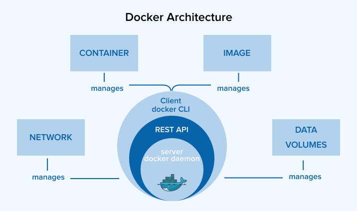

# ⚙️ Архитектура Docker
<!--markdownlint-disable MD046-->



Чтобы понимать, что делает Docker "под капотом", важно разобраться в архитектуре исполнения контейнеров. В этой главе ты узнаешь:

- Как Docker запускает контейнеры
- Что такое `containerd`, `runc` и `libcontainer`
- Как обеспечивается изоляция процессов (`namespaces`, `cgroups`)
- Как взаимодействуют механизмы безопасности (`SELinux`, `AppArmor`)
- Как Docker расширяется за счёт вспомогательных инструментов и сторонних решений

## 🧱 Основные компоненты

### 📦 Docker Daemon (`dockerd`)

**Docker Daemon** — это основное фоновое приложение, обрабатывающее Docker API-запросы, управляющее образами, контейнерами, сетями, томами и пр.

- Запускается как `dockerd`.
- Ожидает подключения от клиентов через **Unix-сокет** (`/var/run/docker.sock`) или **TCP-порт** (например, `2375` без TLS, `2376` с TLS).
- Можно управлять systemd юнитом:

```bash
sudo systemctl enable docker
sudo systemctl start docker
```

### 🖥️ Docker Client (`docker CLI`)

**Клиент Docker** — это интерфейс командной строки, через который разработчики взаимодействуют с демоном:

```bash
docker run alpine echo hello
```

Клиент переводит команду в **HTTP-запрос** к `dockerd`, например:

```bash
POST /containers/create HTTP/1.1
```

!!! info

    Имеется возможность подключить `docker CLI` к удаленному демону.

    ```bash
    export DOCKER_HOST=tcp://192.168.1.100:2375
    ```

---

## 📦 Как Docker запускает контейнеры

### `dockerd` → `containerd` → `runc`

Когда ты запускаешь команду `docker run nginx`, происходит следующее:

- `docker (CLI)` отправляет HTTP-запрос к `dockerd` — демону Docker.
- `dockerd` обращается к `containerd` — это низкоуровневый менеджер контейнеров.
- `containerd` вызывает `runc` — утилиту, которая и создаёт контейнер, используя механизмы ядра Linux.

### Что делает `runc`

`runc` — это стандартный инструмент, реализующий спецификацию [OCI Runtime](https://opencontainers.org/).

Когда `runc` запускает контейнер, он:

- Создаёт новые пространства имён (`namespaces`).
- Применяет ограничения ресурсов через `cgroups`.
- Монтирует изолированную файловую систему.
- Запускает процесс в изолированной среде.

---

## 📡 Сокеты и удалённый доступ

По умолчанию Docker использует **Unix-сокет**, но можно включить поддержку TCP.

### 🔧 Пример конфигурации с systemd

Файл `/etc/docker/daemon.json`:

```json
{
    // Другие опции...
    "hosts": [
        "unix:///var/run/docker.sock",
        "tcp://0.0.0.0:2376"
    ],
    "tls": true,
    "tlsverify": true,
    "tlscacert": "/etc/docker/ca.pem",
    "tlscert": "/etc/docker/server-cert.pem",
    "tlskey": "/etc/docker/server-key.pem"
}
```

> TCP-подключение может понадобиться для CI/CD, удалённого администрирования, тестирования.

---

## 🧩 Изоляция: Как Linux делает контейнеры возможными

Контейнеры — это **не виртуальные машины**.
Они используют ядро хоста, но при этом работают в изоляции.

Это достигается благодаря двум технологиям:

### Namespaces — изоляция ресурсов

**Namespaces** — это механизм ядра Linux, разделяющий доступ к системным ресурсам между процессами.

| Namespace | Назначение                    |
| --------- | ----------------------------- |
| `pid`     | Изолирует список процессов    |
| `net`     | Изолирует сетевые интерфейсы  |
| `mnt`     | Изолирует файловую систему    |
| `ipc`     | Изолирует обмен сообщениями   |
| `uts`     | Изолирует hostname и домен    |
| `user`    | Изолирует пользователей и UID |

**Пример**: контейнер не "видит" процессы хоста, потому что у него отдельный pid-namespace.

### Cgroups - контроль ресурсов

**Control Groups (cgroups)** — это ещё один механизм ядра Linux, позволяющий:

- Ограничивать использование CPU, RAM, диска и сети.
- Приоритезировать процессы.
- Мониторить и завершать группы процессов.

**Пример**: можно ограничить контейнер 100MB памяти:

```bash
docker run --memory="100m" nginx
```

---

## 🧱 libcontainer

`libcontainer` — это библиотека, разработанная Docker для управления низкоуровневыми возможностями ядра напрямую.

До неё Docker использовал LXC как промежуточный слой. Теперь `libcontainer`:

- Работает напрямую с `cgroups`, `namespaces`, `seccomp`, `apparmor` и др.
- Является ядром `runc`.

> `libcontainer` — то, что позволило Docker отказаться от LXC и полностью контролировать контейнеры.

---

## 🌐 Взаимодействие с внешними системами

Docker не существует в изоляции. Его можно интегрировать с другими компонентами для расширения возможностей.

### 📡 Сетевые плагины (CNI)

Docker по умолчанию использует собственную сетевую модель.

Но можно подключить и другие CNI:

- **Weave** — простая peer-to-peer сеть.
- **Calico** — для масштабируемых и безопасных сетей.
- **Flannel** — простое покрытие IP-адресов.

### 🔍 Службы обнаружения (Service Discovery)

Позволяют находить контейнеры внутри динамической среды:

- **Consul** — KV-хранилище и сервис-реестр.
- **etcd** — распределённое хранилище от CoreOS.
- **SkyDNS** — DNS на базе etcd.
- **Registrator** — автоматически регистрирует контейнеры в Consul/etcd.

### 💾 Подключаемые хранилища

Контейнеры могут использовать внешние хранилища данных, такие как:

- **Flocker** — переносимость томов между хостами.
- **GlusterFS** — распределённая файловая система.
- **Ceph** — масштабируемое блочное/объектное хранилище.

Используются через `Volume plugins`.

### 🏷️ Внешние реестры

Можно использовать сторонние или корпоративные хранилища образов:

- Harbor
- JFrog Artifactory
- Quay
- GitLab Registry

> Часто поддерживают RBAC, сканирование уязвимостей, аудит.

---

## 🔌 Вспомогательные технологии Docker

Docker — это не только контейнеры, но и богатая экосистема инструментов.

### 🐳 Docker Compose

Позволяет описывать многоконтейнерные приложения в `docker-compose.yml`:

```bash
version: '3'
services:
  web:
    image: nginx
    ports:
      - "80:80"
```

[Подробнее](./compose.md).

### 🐝 Docker Swarm

Встроенная в Docker система оркестрации:

- Несколько хостов объединяются в кластер.
- Контейнеры масштабируются и перемещаются между узлами.
- CLI совместим с обычным Docker.

[Подробнее](./swarm.md).
